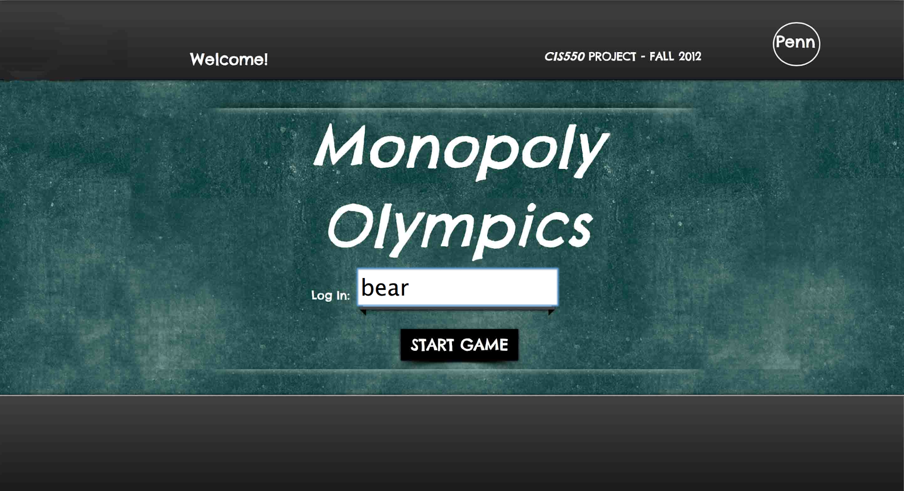

olympics-database-web-application
=================================

Innovated a multi-player game like Richman in Java Servlet JSP based on a very large dataset of 2012 Olympics, including exotic web UI, multithreaded server, AJAX interaction, and MySQL database. 
Imported huge XML using XQuery and improved SQL query efficiency by query optimization such as indexing, view and join ordering.

## _About_

    CIS550, Database & Information Systems, Fall 2012, University of Pennsylvania
    Yayang Tian, Chen Chen, Cong Liao, Wenbin Zhao

## _Instructions_

1.  The codes are based on Google App Engine. The best way to run the program is to directly visit the website at: http://monopolyolymics.appspot.com/. If multiple players are required, you can simply open multiple webpages to simulate multiple players.

2.	The code is written as Java Servlet, and the code structure is similar to Apache. The source files on in src folder. Other files such as html, javascript and images are in war folder.

3.	The best way to modify the code is to use Eclipse. Google App Engine has an Eclipse plug-in which is very convenient. The way to install Google Plug-in is: https://developers.google.com/appengine/docs/java/tools/eclipse.

4.	After installing Google Plug-in, you can open the project by using Eclipse. Click :”Run” -> “Run As” -> “Web Application”, then the server will run on local machine at http://localhost:8888/.

5.	Open this url in a web browser. Open multiple webpages if needed, and then you can run the program locally.

6.	Server-end java files on in src/mono. The Monopoly_Server class is the most important class. It maintains a singleton server program to deal with request. GameMonopolyServlet class acts as an interface between Monopoly_Server and the Ajax requests with front-end. It receives Ajax requests from front-end, passes requests to Monopoly_Server, receives responses from Monopoly_Server and send them back to front-end.

7.	Several static members are on top of Monopoly_Server class. MaxNumPlayers is the number of players in the game, ans should be 2, 3, or 4. NumInitGoldMedals is the number of initial "money" each player has. It should be a reasonable positive number. You can modify these two static variables as you like. Please do not modify other variables.

8.	If you are playing the game on http://monopolyolymics.appspot.com/, you MUST complete the game! Otherwise the server will wait for you so other people cannot play.

## _Showcase_

1. Login.

Login with your player name, respectively. For example, "bear", "monster", and "donkey".

    
