olympics-database-web-application
=================================

Innovated a multi-player game like Richman in Java Servlet JSP based on a very large dataset of 2012 Olympics, including exotic web UI, multithreaded server, AJAX interaction, and MySQL database. 
Imported huge XML using XQuery and improved SQL query efficiency by query optimization such as indexing, view and join ordering.

## _About_

    CIS550, Database & Information Systems, Fall 2012, University of Pennsylvania
    Yayang Tian, Chen Chen, Cong Liao, Wenbin Zhao

## _Instructions_

1.  The codes are based on Google App Engine. The best way to run the program is to directly visit the website at: http://monopolyolymics.appspot.com/. If multiple players are required, you can simply open multiple webpages to simulate multiple players.

2.	The code is written as Java Servlet, and the code structure is similar to Apache. The source files on in src folder. Other files such as html, javascript and images are in war folder.

3.	The best way to modify the code is to use Eclipse. Google App Engine has an Eclipse plug-in which is very convenient. The way to install Google Plug-in is: https://developers.google.com/appengine/docs/java/tools/eclipse.

4.	After installing Google Plug-in, you can open the project by using Eclipse. Click :”Run” -> “Run As” -> “Web Application”, then the server will run on local machine at http://localhost:8888/.

5.	Open this url in a web browser. Open multiple webpages if needed, and then you can run the program locally.

6.	Server-end java files on in src/mono. The Monopoly_Server class is the most important class. It maintains a singleton server program to deal with request. GameMonopolyServlet class acts as an interface between Monopoly_Server and the Ajax requests with front-end. It receives Ajax requests from front-end, passes requests to Monopoly_Server, receives responses from Monopoly_Server and send them back to front-end.

7.	Several static members are on top of Monopoly_Server class. MaxNumPlayers is the number of players in the game, ans should be 2, 3, or 4. NumInitGoldMedals is the number of initial "money" each player has. It should be a reasonable positive number. You can modify these two static variables as you like. Please do not modify other variables.

8.	If you are playing the game on http://monopolyolymics.appspot.com/, you MUST complete the game! Otherwise the server will wait for you so other people cannot play.

## _Showcase_

1. Login.

Login with your player name, respectively. For example, "bear", "monster", and "donkey".

2. Waiting Your Friends

Then you arrive at the game lobby, waiting for your friends to start game. The default number of players are three.

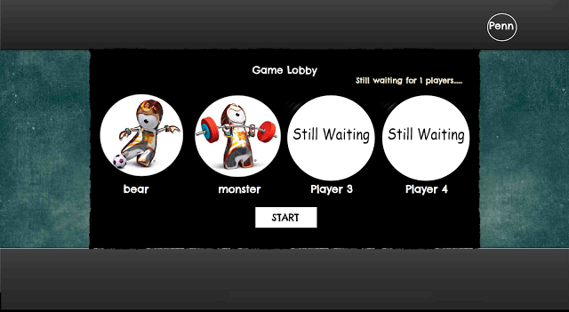

3. Play!

There are altogether TWO big steps: 

Step1:   Roll Dice

Step 2:  Go.

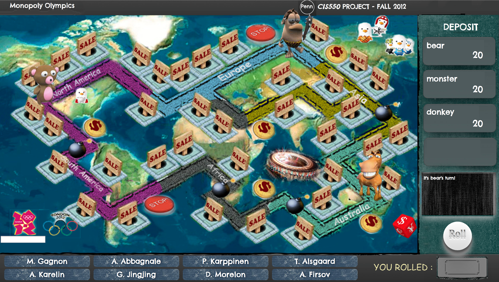

Circumstance 1:  When you arrive at a house,  decide whether to buy a house. 

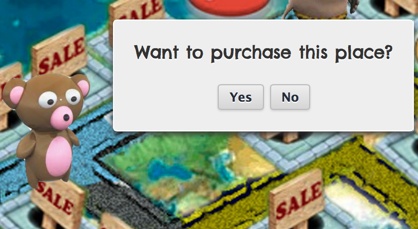

If you choose to buy a house, select one of the 8 athletes below, and use it's number of gold medals as your property! 

So when other people step onto it, they will charge that amount of money. 

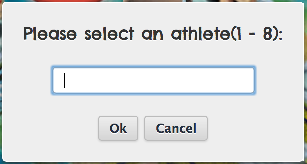

To see the information of the  card, you can click on the card to view it. Note that we have done preprocessing about the athletes: trimmed names and picked ones with gold medals more than 3.

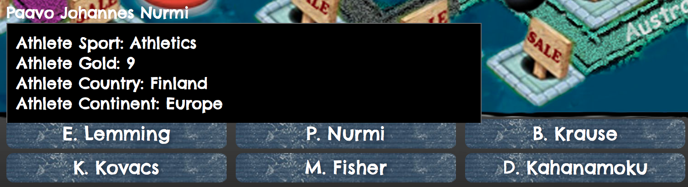

So when you entered the number. You can see the house that belongs to you! 

One inspiring thing you have to know is that the owner sometime can change double, in case the house is located in the same continent in which the athlete belongs.

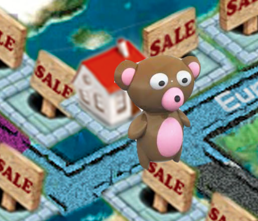

It is also essential to note that the history board on the right is recording all the information that you should be aware of.

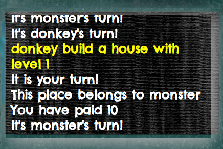

What's more, you can view your deposit in real time to not fall behind.

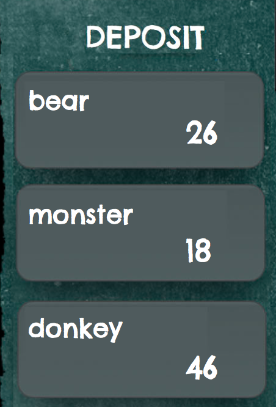

Circumstance 2:  When you arrive at a money sign, you will get extra money!

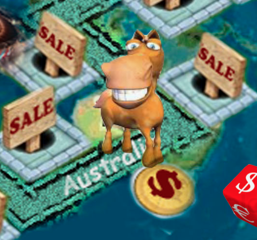

Circumstance 3: But when you step onto a bomb, you will lose a lot of money, which may directly drive you into bankruptcy! 

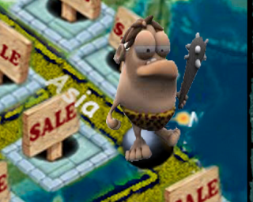

Circumstance 4: When you step onto a stop sign, you will stop for one turn and wait for others.

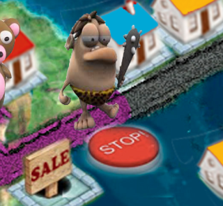

Circumstance 5: When you step onto another player's house, you will be charged some money for that.

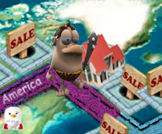

Circumstance 6:  When you step onto your house again, you may upgrade your house to charge more money for others.
There are altogether 3 levels for the houses.

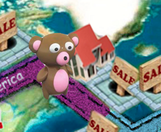

For the example on the right, the bear has now upgraded to the 3rd level. 

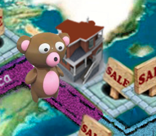

Circumstance 7:  When you are bankruptcy, you will be kicked out of the game. In this case, your house will not charge the remaining players. So the last player survived will be the winner.

Finally, take a look at the screenshot at the end of an intense game. You must find it interesting. Hope you enjoy : )

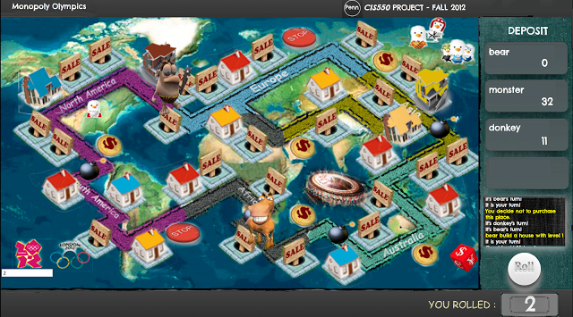

    
